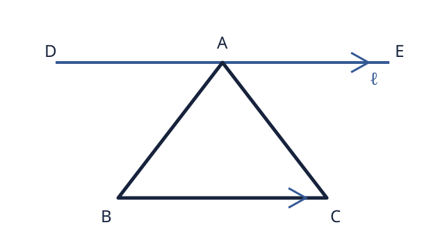

## 説明

### 定理が表すこと

**内角**とは、三角形の内側にある三つの角です。この定理が使えるのは、**平らな面にある三角形**です。この:ruby[条件]{reading="じょうけん"}のもとで、三つの内角をそれぞれ $\alpha$、$\beta$、$\gamma$ とすると、次の式が成り立ちます。

$$
\alpha + \beta + \gamma = 180^\circ
$$

つまり、**三つの内角の和は $180^\circ$ です**。地球の表面のような曲がった面にある三角形には、この定理をそのまま使うことはできません。

記号は、$\alpha$（アルファ）、$\beta$（ベータ）、$\gamma$（ガンマ）と読みます。

### 直感

紙にかいた三角形の三つの角を切り取り、角の先を一つの点に集めて横に:ruby[並べる]{reading="ならべる"}と、一直線になります。一直線の:ruby[片側]{reading="かたがわ"}に:ruby[並ぶ]{reading="ならぶ"}角の和は $180^\circ$ なので、三つの内角の和も $180^\circ$ になると考えられます。

この方法は関係を目で:ruby[確かめる]{reading="たしかめる"}助けになります。ただし、紙を切って:ruby[確かめる]{reading="たしかめる"}だけでは、すべての三角形について:ruby[証明した]{reading="しょうめいした"}ことにはなりません。

### :ruby[証明]{reading="しょうめい"}に使う:ruby[性質]{reading="せいしつ"}

証明では、次の二つの性質を使います。

- 一直線の:ruby[片側]{reading="かたがわ"}に:ruby[並ぶ]{reading="ならぶ"}角の和は $180^\circ$ です。
- 二本の平行線を別の直線が横切るとき、平行線の内側で、横切る線をはさんで反対側にある二つの角は等しくなります。この二つの角を:ruby[錯角]{reading="さっかく"}といいます。

### 証明の見通し

三角形 $ABC$ の点 $A$ を通り、辺 $BC$ と平行な直線 $\ell$ を引きます。直線 $\ell$ 上に、$D,A,E$ がこの順に:ruby[並ぶ]{reading="ならぶ"}よう点 $D,E$ を取ります。辺 $AB$ と辺 $AC$ は二本の平行線を横切るので、角 $B$、角 $C$ と同じ大きさの角を、点 $A$ のそばに:ruby[移して]{reading="うつして"}考えられます。

すると、三つの内角が一直線の:ruby[片側]{reading="かたがわ"}に:ruby[並びます]{reading="ならびます"}。証明の中心となる考え方は、**三つの角を一つの点のそばに集め、一直線の角にすること**です。

:::details{summary="証明の詳細" summaryReading="しょうめいのしょうさい"}
角 $A$、角 $B$、角 $C$ の大きさを、それぞれ $\alpha$、$\beta$、$\gamma$ とします。

点 $A$ を通り、辺 $BC$ と平行な直線 $\ell$ を引きます。直線 $\ell$ 上に、$D,A,E$ がこの順に:ruby[並ぶ]{reading="ならぶ"}よう点 $D,E$ を取ります。角 $DAB$ を $\beta'$、角 $CAE$ を $\gamma'$ とします。

平行線の:ruby[錯角]{reading="さっかく"}は等しいので、次の関係があります。

$$
\beta' = \beta, \qquad \gamma' = \gamma
$$

$\beta'$、$\alpha$、$\gamma'$ は、直線 $\ell$ の:ruby[片側]{reading="かたがわ"}に:ruby[並ぶ]{reading="ならぶ"}角です。したがって、

$$
\beta' + \alpha + \gamma' = 180^\circ
$$

です。$\beta' = \beta$、$\gamma' = \gamma$ を入れると、

$$
\alpha + \beta + \gamma = 180^\circ
$$

となり、三角形の三つの内角の和が $180^\circ$ であることが分かります。
:::

## 例題

### 例題 1：残りの内角を求める

**問題**

三角形の二つの内角が $48^\circ$ と $67^\circ$ です。残りの内角を求めてください。

**考え方**

三つの内角の和 $180^\circ$ から、分かっている二つの角の和を引きます。

:::details{summary="解答を見る" summaryReading="かいとうをみる"}
残りの内角を $x$ とすると、

$$
\begin{aligned}
x
  &= 180^\circ - (48^\circ + 67^\circ) \\
  &= 180^\circ - 115^\circ \\
  &= 65^\circ
\end{aligned}
$$

したがって、**残りの内角は $65^\circ$ です**。
:::

### 例題 2：曲がった面の三角形

**問題**

球の表面に、大円の:ruby[弧]{reading="こ"}を辺とし、三つの内角がそれぞれ $90^\circ$ となる三角形があります。この三角形は、三角形の内角の和の定理に反していますか。

**考え方**

角度の合計だけでなく、定理が使える面の条件を:ruby[確かめます]{reading="たしかめます"}。

:::details{summary="解答を見る" summaryReading="かいとうをみる"}
三つの内角の和は、

$$
90^\circ + 90^\circ + 90^\circ = 270^\circ
$$

です。しかし、この三角形は曲がった面にあります。定理の条件である「平らな面にある三角形」ではないので、**定理に反する例ではありません**。
:::

## :ruby[練習問題]{reading="れんしゅうもんだい"}

1. 三角形の二つの内角が $35^\circ$ と $75^\circ$ のとき、残りの内角を求めてください。
2. 三つの角が $90^\circ$、$60^\circ$、$40^\circ$ である図形は、平らな面で三角形になりますか。角度の和を使って理由も答えてください。

:::details{summary="練習問題の解答と考え方" summaryReading="れんしゅうもんだい|かいとう|かんが|かた"}
1. $180^\circ - (35^\circ + 75^\circ) = 70^\circ$ なので、残りの内角は $70^\circ$ です。
2. 三つの角の和は $90^\circ + 60^\circ + 40^\circ = 190^\circ$ です。$180^\circ$ ではないので、平らな面では、この三つを内角とする三角形にはなりません。
:::
